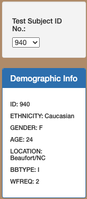
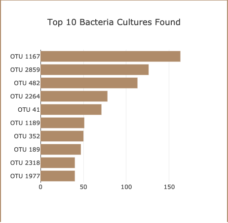
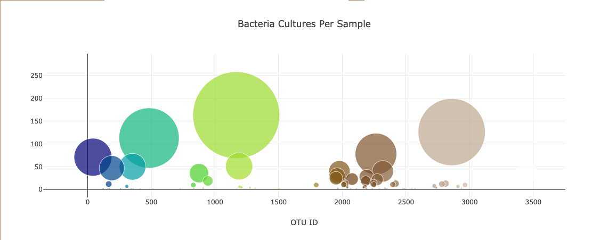
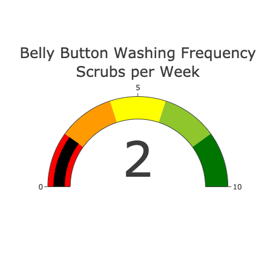

## Overview
In this project, we used Plotly.js to create an interactive data virtualization for the web. We virtualized the types of bacteria that colonized the volunteer's bellies and conveyed data to both volunteers and researchers.
## Resources
-	Data Source: samples.json
-	Tools: VS Code, Web browser, Terminal
## Summary
A dropdown menu and an info panel have been created to select an ID number and populate the person’s information.

The horizontal bar chart would display the top 10 bacterial species (OTUs) when an ID was selected.

The bubble chart would show the bacteria cultures, such as OUT_ID and bacteria sample values for the ID selected.

The gauge chart displayed the selected ID’s weekly washing frequency.

The web has been displayed to GitHub Pages.
Github.io: https://kun-kz.github.io/Plotly_Deployment/
